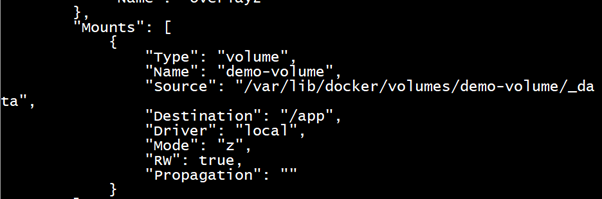
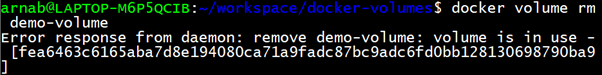

# Docker Volumes – A Beginner-Friendly Practical Guide with Real-World Use Cases

This project is a hands-on, beginner-friendly guide to understanding **Docker Volumes** — one of the most important features when working with containers.

By default, Docker containers are **ephemeral** — meaning any data stored inside them is lost the moment the container stops, crashes, or is removed.

In this guide, we'll explore:

- Why this happens
- What problems it causes in real-world scenarios
- How Docker solves this using **Volumes** and **Bind Mounts**
- A step-by-step demo using a real container (NGINX)
- How to inspect, manage, and delete volumes
- Best practices for using Docker Volumes in your projects

---

## Why Data Disappears in Containers

When you run a container, it:
- Shares the **host's CPU, memory, and disk** resources
- Lives in an **isolated environment**
- Writes its data to its **own internal file system**

But this internal file system **disappears** when the container is stopped or deleted. So if:
- You generate a log file inside a container
- Or store user uploads, temp files, config data...

...it all vanishes unless you've stored it **outside the container**.

This is great for lightweight, stateless apps — but not so great for real-world use cases.

---

## Real Problems Without Persistent Storage

Let’s look at real situations where this causes trouble:

### Problem 1: Losing Logs & User Activity
An app runs in a container. It logs:
- IP addresses
- Login attempts
- Timestamps

But if the container crashes or is deleted, **all logs vanish**. No history, no audit trail, no way to track security issues.

---

### Problem 2: Frontend–Backend Data Sharing
Imagine two containers:
- Backend writes dynamic data (like a `data.json`)
- Frontend reads and displays that data

If the backend container goes down, the file is gone, and the frontend breaks — no dynamic content is available.

---

### Problem 3: Container Needs Host File
A host cron job creates a file that must be read by a container.

But the container can't access host files unless you explicitly allow it. Without that, the container can’t do its job.

---

## The Solution: Bind Mounts and Volumes

Docker gives us two ways to share data between containers and the host:

---

### 1. **Bind Mounts**

- You specify a **host folder** to bind to a **container path**
- Example:
  ```bash
  docker run -v /home/user/app:/app nginx
  ```

- Anything written to `/app` inside the container appears on the host at `/home/user/app`, and vice versa

 Good for local development, debugging, or accessing specific host files  
 Not portable — tied to the exact host path structure

---

### 2. **Docker Volumes (Recommended)**

- Docker **creates and manages** a special volume for you
- You don't need to provide a host path — Docker handles it internally

Example:
```bash
docker run --mount source=my-volume,target=/app nginx
```

 More secure  
 Portable and isolated  
 Can be stored on external devices or cloud services like:
- EC2
- Amazon S3
- NFS
- Volume drivers like EBS, GlusterFS, etc.

---

## Why Use Volumes?

### Volumes:
- Are created by Docker using `docker volume create`
- Have their own lifecycle (`inspect`, `rm`, `prune`)
- Can be reused by multiple containers
- Can persist even after containers are stopped or deleted
- Can be backed up and moved across machines/clouds

> Use Volumes **by default** in production or when data persistence matters  
> Use Bind Mounts **only when** you need direct access to host files

---

## Hands-On Practical Steps

Let’s now go through a hands-on exercise using the official **NGINX** container and a Docker-managed volume.

---

### Step 1: Create a Volume

```bash
docker volume create demo-volume
```

This creates a logical, managed volume. Docker stores it somewhere like:
```
/var/lib/docker/volumes/demo-volume/_data
```

You can list all volumes with:

```bash
docker volume ls
```

---

### Step 2: Run a Container and Mount the Volume

We’ll run a container and mount the volume to `/app` inside it:

```bash
docker run -d \
  --name web-server \
  --mount source=demo-volume,target=/app \
  nginx:latest
```

This does the following:
- Starts a container using the official `nginx` image
- Mounts the `demo-volume` at `/app` inside the container
- Any files created at `/app` will now be **stored persistently**

---

### Step 3: Inspect the Volume Mount

To verify that the container is actually using the volume:

```bash
docker inspect web-server
```

Look for this in the output:

```json
"Mounts": [
  {
    "Type": "volume",
    "Name": "demo-volume",
    "Source": "/var/lib/docker/volumes/demo-volume/_data",
    "Destination": "/app",
    ...
  }
]
```



This confirms that the container is using the volume.

---

### Step 4: Try to Delete the Volume While It's In Use

If you try:

```bash
docker volume rm demo-volume
```

You’ll get:

```
Error response from daemon: remove demo-volume: volume is in use - [web-server]
```



That’s because Docker protects you from accidentally deleting in-use data.

---

### Step 5: Properly Delete the Volume

To safely remove a volume:

```bash
docker stop web-server
docker rm web-server
docker volume rm demo-volume
```

Only after removing the container can the volume be deleted.

---

## Summary: Why Volumes Matter

- Containers are **ephemeral** — their internal data disappears
- **Volumes** let us keep that data **outside the container**, safely
- Volumes support:
  - Portability
  - Backups
  - Sharing between containers
  - Use on external/cloud storage

> Even if a container crashes, the data stored in a Docker volume is **safe, intact, and reusable**

---

## Bonus: Mount Syntax Options

### Option 1: Shorthand `-v` (Quick but less readable)
```bash
docker run -v demo-volume:/app nginx
```

### Option 2: Verbose `--mount` (Recommended)
```bash
docker run --mount source=demo-volume,target=/app nginx
```

- Easier to read
- Better for team collaboration and production scripts

---

## Final Thoughts

By now, we’ve learned:
- What problem Docker Volumes solve
- The difference between Volumes and Bind Mounts
- How to create, use, inspect, and remove volumes
- Why volumes are preferred in most scenarios

> Docker Volumes are the **bridge between stateless containers and persistent data.**

They help your containerized apps stay lightweight **without sacrificing** durability or flexibility.

---

